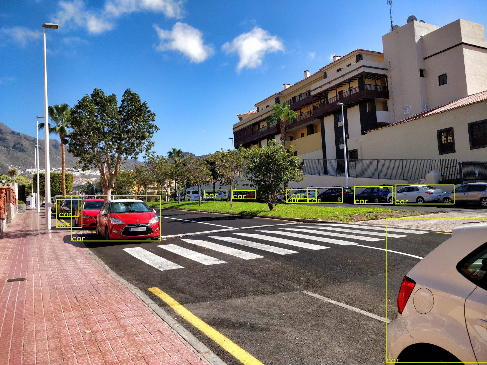

### Simple object detection
Simple wrapper to the openCV AI capabilities.
#### Prerequisite

This setup is only using opencv in python. So install opencv in python: 

``
pip install opencv-python
``

and you are done with that!

Now either train your own model or get the mobilenet here -> 

#### Using

##### With Images
To draw bounding boxes, just initialize SimpleObjectDetection. Then use ``.image_boxes("path of the image")``
to draw the boxes. Plot=True will plot the result. 
To save the image you can use ``save_path="path to the out image"``.
``` python
import time

from SimpleObjectDetection import SimpleObjectDetection

x = SimpleObjectDetection()
x.image_boxes("test.jpg", plot=True)

time.sleep(100)
```

This returns:


###### Custom Image detection
Here an example on how to draw circles in the center of an detected object:
``` python
import cv2
import time

from SimpleObjectDetection import SimpleObjectDetection

def get_center(small_value, big_value):
    return int(((big_value - small_value)/2) + small_value)

# Initialize
x = SimpleObjectDetection()

# create a frame from the image
frame = x.frame_from_image("test.jpg")

# Detect and get the features as an dict from the given frame
features = x.return_detection_features(frame)

# Iterate over each detection
for detection in features:
    # Get all items that have a confidence of 30% or more
    if features[detection]["score"] >= 0.3:
        print(features[detection]["name"])
        width_center = get_center(features[detection]["left"], features[detection]["right"])
        height_center = get_center(features[detection]["top"], features[detection]["bottom"])
        cv2.circle(frame, (width_center, height_center), 5, (0, 255, 0), -1)

cv2.imwrite("pint_img.jpg", frame)
```


#### With video

To draw bounding boxes, just initialize SimpleObjectDetection. Then use ``.video_boxes("path of the video or number of the webcam")``
to draw the boxes. Plot=True will plot the result.

``` python
import time

from SimpleObjectDetection import SimpleObjectDetection

x = SimpleObjectDetection()
x.video_boxes(0, plot=True)
```

#### Creating video functions
Here an example on how to draw circles in the center of detected objects:
``` python
import cv2

from SimpleObjectDetection import SimpleObjectDetection


def get_center(small_value, big_value):
    return int(((big_value - small_value)/2) + small_value)

a = SimpleObjectDetection()

# Open the video stream. With a number you select a webcam. With a filepath you select a video file
cap = cv2.VideoCapture(0)
while cap.isOpened():
    # Retrieve frames
    ret, frame = cap.read()
    # Detect the features
    features = a.return_detection_features(frame)
    for detection in features:
        # Get all items that have a confidence of 30% or more
        if features[detection]["score"] >= 0.3 and features[detection]["name"] == "person":
            width_center = get_center(features[detection]["left"],
                                      features[detection]["right"])
            height_center = get_center(features[detection]["top"],
                                       features[detection]["bottom"])
            cv2.circle(frame, (width_center, height_center), 5, (0, 255, 0), -1)
    if True:
        cv2.imshow('img', frame)
        if cv2.waitKey(25) & 0xFF == ord('q'):
            pass
```